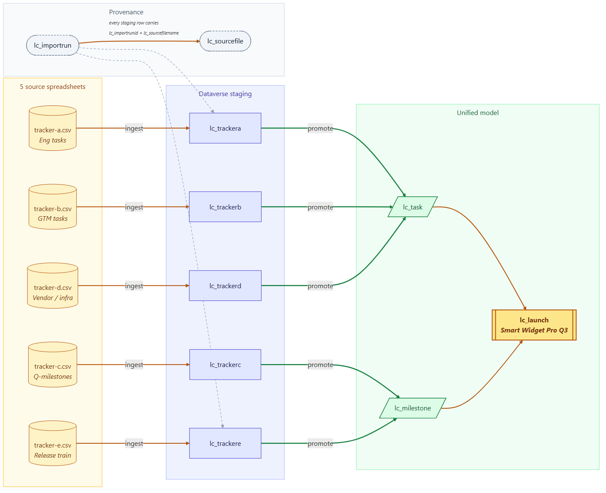

# Episode 1 — AI-Powered Data Modeling

https://github.com/jamesoleinik/launch-control/raw/master/episodes/ep-01-data-modeling/video.mp4

**Status:** ✅ Built · 🎬 Recorded
**Features:** ⭐ Official Dataverse plugins for Copilot & Claude Code · ⭐ Mapping-driven schema · ⭐ Provenance from day one
**Layer:** 🟢 Layer 1 (Data) — the foundation
**Coding agent:** GitHub Copilot (with `dataverse@awesome-copilot`) · **Runtime:** `PowerPlatform-Dataverse-Client` (Python)

---

## The hook

> _"Every team has shadow trackers — spreadsheets, Notion pages, Loop tabs — and they drift. Before any agent can help, we need one model that tells the truth."_

I didn't draw this data model in the maker portal. I described the business in
plain English to a coding agent, and the agent did the work — proposed the
tables, wrote the Python, ran it against the environment, iterated when
something broke. That's possible because **Microsoft now ships official
Dataverse plugins for the two big coding agents**: `dataverse@awesome-copilot`
for GitHub Copilot (and the Copilot CLI), and `dataverse@claude-plugins-official`
in Anthropic's official Claude Code plugin registry. Install either one and
your coding agent suddenly knows how to model on Dataverse — typed columns,
choices, lookups, provenance, solution membership, the lot.

The Python files you see in this repo (`create_datamodel.py`,
`modeling_skill.py`, `ep1_provenance.py`, `seed_data.py`) are what the coding
agent *produced* with the plugin loaded. Re-runnable, idempotent, in source
control.

---

## Get the plugin

Two installs — pick whichever coding agent you use. Both are one-liners
typed into the agent itself:

| Coding agent | Install command | Source |
|---|---|---|
| **GitHub Copilot / Copilot CLI** | `/plugin install dataverse@awesome-copilot` | [microsoft/Dataverse-skills](https://github.com/microsoft/Dataverse-skills) (also surfaced via the [awesome-copilot](https://github.com/github/awesome-copilot) marketplace) |
| **Claude Code** | `/plugin install dataverse@claude-plugins-official` | [microsoft/Dataverse-skills](https://github.com/microsoft/Dataverse-skills) (surfaced via Anthropic's official Claude Code plugin registry) |

Same skill content under the hood, both maintained by Microsoft. Once the
plugin is installed, ask the agent _"connect to Dataverse"_ — the
`dv-connect` skill walks through the Dataverse CLI / Python SDK / PAC CLI
install, authenticates against your environment, and registers the
Dataverse MCP server. After that, your coding agent knows how to do
Dataverse modeling, data work, solution lifecycle, and MCP setup —
without you having to teach it the conventions every conversation.

---

## What gets built

### Unified model (created by `scripts/create_datamodel.py`)
| Table | Purpose |
|---|---|
| `lc_Launch` | The product launch (root) |
| `lc_Milestone` | Phase gates that roll up to a launch |
| `lc_Task` | Owned work items under a milestone |
| `lc_TeamMember` | People assigned to a launch |
| `lc_StatusUpdate` | Time-series narrative updates |

### Provenance (created by `scripts/ep1_provenance.py`)
| Table | Purpose |
|---|---|
| `lc_ImportRun` | One row per ingestion (status, count, notes) |
| `lc_SourceFile` | Per-file metadata (name, row count, checksum) |

Plus an `lc_ImportRun` lookup added to every core and staging table.

### Staging tables (created by `scripts/modeling_skill.py` from `unified_mapping.yaml`)
| Table | Source tracker | Promotes to |
|---|---|---|
| `lc_TrackerA` | `tracker-a.sample.csv` | `lc_Task` |
| `lc_TrackerB` | `tracker-b.sample.csv` | `lc_Task` |
| `lc_TrackerC` | `tracker-c.sample.csv` | `lc_Milestone` |
| `lc_TrackerD` | `tracker-d.sample.csv` | `lc_Task` |
| `lc_TrackerE` | `tracker-e.sample.csv` | `lc_Milestone` |

> Tracker names are intentionally generic. Every team has 5+ shadow trackers
> with slightly different shapes — these placeholders represent the *kinds* of
> sheets you'll find (feature lists, planning sheets, roadmap tabs, tooling
> logs, release plans) without leaking specifics.

> The filename `modeling_skill.py` is a nod to what produced it — the
> Dataverse plugin teaching the coding agent how to model. The script
> itself is just typed Python that calls the SDK.

Every staging table automatically gets four provenance columns
(`lc_SourceSystem`, `lc_SourceFilename`, `lc_SourceRowHash`,
`lc_NeedsManualReview`) and an `lc_ImportRun` lookup.

### Data flow diagram (generated by `scripts/python/flow_diagram.py`)

The agent also produced a flow diagram of the model it built — Mermaid source in
[`artifacts/flow.mmd`](../../artifacts/flow.mmd), rendered PNG at
[`artifacts/flow.png`](../../artifacts/flow.png). Laid out as a **left-to-right
data flow**: 5 source spreadsheets → Dataverse staging tables (one per source
system) → unified launch model (`lc_task` / `lc_milestone`) → the parent
`lc_launch`. The Provenance corner shows the `lc_importrun` + `lc_sourcefile`
backbone that every staging row carries. Re-runnable: edit the model,
regenerate with `python scripts/python/flow_diagram.py`.



---

## How it works

`datamodel/mappings/unified_mapping.yaml` is the single source of truth for
the staging schema — *one* file the coding agent and I worked on together,
not five tables created click-by-click in the maker portal:

```yaml
- source: tracker-a.sample.csv
  target_entity: lc_TrackerA
  primary_column: lc_Title
  promote_to: lc_Task
  fields:
    title:    { schema: lc_Title,      type: string,  display: Title }
    priority: { schema: lc_Priority,   type: choice,  display: Priority,
                options: [Low, Medium, High, Critical] }
    status:   { schema: lc_Status,     type: choice,  display: Status,
                options: [NotStarted, InProgress, Blocked, Done] }
```

`scripts/modeling_skill.py` walks this file and calls
`client.tables.create(...)` for each tracker, building columns by type and
assigning stable option-set integers (fixed offsets per `(table, field)`).
The provenance fields are appended uniformly. After all tables exist, it
adds the `lc_ImportRun` lookup using lowercase logical names. All of that
boilerplate the Dataverse plugin taught the coding agent to handle.

---

## Rebuild it with a coding agent

This episode is *about* the coding agent doing the modeling. So the most honest reproduction path is to give your own coding agent the same prompts I gave mine. Open Copilot CLI (or Claude Code) in this repo's root with the [dataverse plugin](#get-the-plugin) loaded, authenticate PAC CLI against a fresh Dataverse environment (`pac auth create --environment https://<your-org>.crm.dynamics.com/`), **enable the [Dataverse MCP server](https://learn.microsoft.com/en-us/power-apps/maker/data-platform/data-platform-mcp-preview-tools) on that environment** (PPAC → environment → Settings → Features → turn on **MCP for makers**, then add your coding-agent client ID to the allow-list — the plugin's `dataverse-mcp-configure` skill will walk you through it), then run these in order:

**1. Set up the workspace**
```
Set up this folder as a Dataverse workspace pointing at https://<your-org>.crm.dynamics.com/.
```

**2. Publisher + solution**
```
Create a publisher "Launch Control" with prefix lc_ and a solution "LaunchControl".
```

**3. The data model**
```
Five shadow trackers live in datamodel/samples/. Model these as Dataverse
tables: a unified launch model (Launch, Milestone, Task, TeamMember,
StatusUpdate) on top of staging tables that keep provenance. Propose the
schema first, then build it in the LaunchControl solution.
```

**4. Seed demo data**
```
Seed a "Q3 Widget Launch" with realistic demo data — six milestones across
teams, a dozen tasks with mixed statuses including a couple blocked, four
team members with fictional names, a few status updates. Keep it sanitized
for OSS.
```

**5. Pull to the repo**
```
Export LaunchControl unmanaged and unpack it into datamodel/solutions/ep1_unified_model/.
```

**6. Verify**
```
Verify the rebuild — row counts per table, relationships intact, show me Q3
Widget Launch with its children.
```

The agent will hit you with confirmation prompts along the way (target env URL, publisher prefix, schema proposal). Approve what makes sense; redirect what doesn't. That's the whole point — you're the PM, the agent is doing the modeling.

---

## Reproduce (deterministic re-run)

If you'd rather skip the agent loop and just re-run the artifacts the agent produced last time:

```pwsh
# 1. Core unified model
python scripts/create_datamodel.py

# 2. Provenance tables + lookups
python scripts/ep1_provenance.py

# 3. Staging tables generated from unified_mapping.yaml
python scripts/modeling_skill.py

# 4. Seed sanitized rows + capture an lc_ImportRun
python scripts/seed_data.py
```

The exported, sanitized solution lives at
`datamodel/solutions/ep1_unified_model/` (re-exportable with `pac solution
export --name LaunchControl`).

---

## What this episode showcases

1. **Official Dataverse plugins for the major coding agents.** Microsoft now
   ships `dataverse@awesome-copilot` for GitHub Copilot (and the Copilot CLI)
   and `dataverse@claude-plugins-official` in Anthropic's official Claude Code
   plugin registry. Install either with one `/plugin install …` and the
   coding agent stops guessing — it knows the Dataverse conventions, the
   SDKs, the publisher/solution rules, the MCP setup. Pick your agent;
   the plugin meets it there.
2. **AI-powered modeling, not click-ops.** With the plugin loaded, *"here
   are my trackers, here's a mapping"* becomes a typed Dataverse schema —
   choice columns, lookups, provenance, solution membership. The coding
   agent does the SDK calls; you stay in the conversation.
3. **Provenance from day one.** Every row knows where it came from
   (`lc_SourceSystem`, `lc_SourceFilename`, `lc_SourceRowHash`,
   `lc_ImportRun`). No spreadsheet detective work later.
4. **Sanitized & shareable.** Only sample CSVs and the mapping file ship in
   the repo; raw trackers are git-ignored.

---

## Files in this episode

- `datamodel/mappings/unified_mapping.yaml`
- `datamodel/samples/*.sample.csv`
- `datamodel/seed-data/*.seed.csv` *(generated by `seed_data.py`)*
- `datamodel/solutions/ep1_unified_model/` *(unpacked LaunchControl solution)*
- `scripts/create_datamodel.py`
- `scripts/ep1_provenance.py`
- `scripts/modeling_skill.py`
- `scripts/seed_data.py`

---

## Next up

**Episode 2 — Process Modeling.** Episode 1 was about how the *coding
agent* gets help — an official plugin in the marketplace it already trusts.
Episode 2 shifts to the *runtime agents* (Copilot Studio, Claude, M365
Copilot) and how Dataverse gives them their own help: the coding agent reads
the launch playbook and generates **Business Skills** the runtime agents can
execute against live data.


