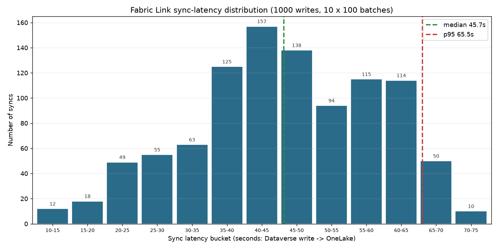

# Episode 10: Dataverse + Fabric (the analytical layer)

**Status:** ✍️ Draft · 🎬 Not yet recorded
**Build status:** Fabric Link, latency probe, semantic model, 3-page report, and demo data all built programmatically against the live tenant; the Copilot Cowork grounding (Section 4) is the only maker-portal step (2026-08-02)
**Season:** 2 (Dataverse, Better Together)
**Features:** ⭐ Dataverse Link to Microsoft Fabric (near-real-time mirror to OneLake) · ⭐ Analytical enrichment + aggregation views over the Lakehouse SQL endpoint · ⭐ Power BI Direct Lake semantic model (authored from code, no DAX) · ⭐ The Fabric data plugin in Microsoft 365 Copilot Cowork
**Layer:** 🔵 Layer 2 (proactive automation) over an analytical data foundation
**Coding agent:** Python automation (Dataverse Web API + Fabric REST API: TMSL model + PBIR report) against the live tenant
**Runtime showcased:** the **programmatic Direct Lake analytical layer** (the coding agent authors the enrichment views, model, relationships, and aggregation measures via T-SQL / TMSL / PBIR: no Power BI Desktop authoring and no hand-written DAX)

> **Building this episode?** This README is the follow-along: each section has a
> short prompt you give the coding agent (or the maker-portal steps you take) and
> what you run on screen. Load the `dataverse-fabric-analytics` skill (`SKILL.md`)
> first: it holds the technical how, so the prompts can stay short. `plan.md` is the
> deeper runbook and `powerbi_report_spec.md` is the model + report spec.

---

## The hook

> *"Dataverse tells me the state of this one launch. It can't tell me whether this
> launch is normal. Fabric can: it holds the history of every launch we have run and
> the related datasets around them, so I can enrich this launch and roll it up against
> the whole portfolio, over time."*

Dataverse is the transactional system of record for a single launch. It is not built
to answer *is this launch an outlier?* or *what is our RED rate trending across the
portfolio?* Those are analytical questions: they need related datasets and top-level
aggregation over history. This episode adds that plane with **Microsoft Fabric**:
mirror the operational tables to OneLake, enrich them with related sources, and build
the cross-launch and historical aggregation metrics, surfaced in a Power BI report
and in Microsoft 365 Copilot Cowork.

## Why Fabric, not another Dataverse table (the design rule)

The boundary test: *would this naturally be a single row I query, relate, secure, or
transact?*

- **Yes -> Dataverse.** The live transactional state of one launch.
- **No, it is cross-record / multi-source / historical aggregation -> Fabric.** RED
  rate versus the portfolio median, open ERP exposure rolled up per launch, the
  history of health across every launch, external vendor risk enriched onto the plan.

Fabric earns its place two ways. **Enrichment:** it joins the operational tables to
*related* datasets that do not belong in Dataverse (internal delivery-performance
history, external market/vendor risk, the F&O open-invoice ledger). **Aggregation:**
it computes the top-level metrics a transactional row cannot, across every record and
over time. The clearest signal is the **Vendor List** page's blind-spot table:
Pacific Rim Components (V0004) and Nexus Cloud Services (V0005) exist only in the
enriched risk data. Dataverse has never heard of them. Fabric can surface their risk
profile before they ever appear in an operational record.

## The surface: a Power BI report and the Fabric plugin in Cowork

Instead of a chat agent, the consumption surface is a governed **analytical model**
with two faces: a Power BI report for the human, and the **Fabric data plugin** in
Microsoft 365 Copilot Cowork. Both read the same Direct Lake model, so the same
enriched, aggregated metrics answer a click or a prompt.

### The headline result

> *"Which launch is most at risk once you factor in the vendors behind it, and how
> does its health compare with everything else we have shipped?"*

1. **Dataverse** owns the live state: a Copilot Studio agent writes an
   `lc_statusupdate` (health = RED) the moment a launch slips.
2. **Fabric Link** mirrors that row to the Lakehouse in seconds (measured median
   ~46s, Section 2), where the enrichment views fuse it with internal delivery
   performance, market vendor risk, and the F&O open-invoice ledger, and the
   aggregation views roll it up against the whole portfolio and its history.
3. **The model synthesizes:** the Q3 Widget Launch is not just RED today; its RED
   rate is above the portfolio median, the vendor behind its blocked task carries
   open ERP exposure and a soft risk tier, and the trend is worsening. One launch,
   many sources, measured against every launch.

Dataverse does not compute the portfolio aggregate or hold the enrichment; the report
does not hold the live transactional write. The analytical model is where they meet.

## The architecture to date (through Episode 10)

The high-level view of everything built across the series so far, with this
episode's additions highlighted. It is a platform view: **clients on top**, then
infrastructure beneath. The access and foundation layers (the MCP server, Business
Skills, custom connectors, security, ingestion) and the system of record (Dataverse +
F&O, Episodes 1-9) were built in earlier episodes. **The orange Microsoft Fabric box
is new in this episode**, and it sits *side by side* with the system of record rather
than on top of it: Fabric Link mirrors the launch and vendor tables into OneLake, then
the enrichment + aggregation views and a Direct Lake model turn that mirror into an
analytical layer, surfaced in a Power BI report and the Fabric data plugin in
Microsoft 365 Copilot Cowork.


> The editable source is `assets/launch-control-architecture.excalidraw` (open it at
> `https://aka.ms/excalidraw`); regenerate the PNG with
> `python assets/_gen_architecture.py`.

The runtime path in Episode 10: a Copilot Studio agent writes `lc_statusupdate`
(health = RED = 10600603) to Dataverse, Fabric Link replicates it *across* to the
Lakehouse SQL analytics endpoint (measured median ~46s over 1000 writes, Section 2),
the enrichment views fuse it with internal performance, market vendor risk, and the
F&O ledger while the aggregation views roll it up across the portfolio and its
history, and the Direct Lake model `Launch Control 360` answers a click in the report
or a prompt in Cowork.

## The build: four sections

The build is one continuous arc. Sections 2 and 3 are authored by a coding agent
from a single prompt each; Sections 1 and 4 are short maker-portal steps because
the Fabric Link and the Cowork grounding are not scriptable.

```
Section 1  Fabric Link   ->  mirror the lc_* and vend* tables to OneLake (maker portal)
Section 2  Backfill+probe->  measure the Dataverse -> OneLake sync latency, graph it (coding agent)
Section 3  Model+report  ->  T-SQL views + Direct Lake model + 3-page report, no DAX (coding agent)
Section 4  Cowork        ->  ground Microsoft 365 Copilot Cowork on the one report (maker portal)
```

> **Local config.** Copy `.env.example` in this folder to `.env` (gitignored) and
> fill in `FABRIC_WORKSPACE_ID`, `FABRIC_WORKSPACE_NAME`, `FABRIC_LAKEHOUSE_ID`,
> `FABRIC_LAKEHOUSE_NAME`, `DATAVERSE_URL`. Select it with
> `LC_ENV=ep-10-dataverse-fabriciq` and set `PYTHONIOENCODING=utf-8`.

## Setup (before Section 1)

This episode needs a **Fabric-entitled** environment: a Dataverse environment with
the `lc_*` launch tables (built in the earlier episodes) plus the F&O `vend*`
mirror tables (Episode 9), and a Microsoft Fabric workspace on capacity to host the
Link, the semantic model, and the report.

1. **Sign in** as the Fabric-entitled account: `az login` (the scripts use
   `AzureCliCredential`). Set `LC_ENV=ep-10-dataverse-fabriciq` and
   `PYTHONIOENCODING=utf-8`.
2. **Python prerequisites:** `pip install pyodbc azure-identity` plus the **ODBC
   Driver 18 for SQL Server** (the probe and the view-apply step connect to the
   Lakehouse SQL analytics endpoint over TDS).
3. **Dataverse MCP server** (for the Plane 1 write in the headline demo): register
   it once with the `dv-connect` skill, exactly as in Episode 9. It is not required
   to build the report, only to demo the live RED write on camera.

The section-by-section build below assumes this is done.

## Section 1 · Create the Fabric Link (mirror the tables to OneLake)

Section 1 stands up the mirror everything else reads: **Link to Microsoft Fabric**
replicates the chosen Dataverse tables into the workspace's OneLake as Delta, with a
SQL analytics endpoint over them, in near real time and with no ETL. This is a maker
action in the Power Apps portal, not a script.

### What the maker does

1. In the **Power Apps maker portal** (`make.powerapps.com`), select the
   Fabric-entitled environment, then open **Tables** and choose **Analyze -> Link to
   Microsoft Fabric**.
2. Pick the target **Fabric workspace** (the one whose ids you put in `.env`).
3. **Select the tables** to mirror. For this episode: the launch tables
   `lc_launch`, `lc_task`, `lc_statusupdate`, `lc_vendorwork`, `lc_milestone`,
   `lc_teammember`, and the F&O mirror tables `vendtable` and `vendtransopen`. Each
   selected table must have **change tracking** enabled (the portal enables it when
   you add the table).
4. **Create the link.** Fabric provisions a Lakehouse in the workspace and does the
   initial sync; after that, writes replicate continuously.

### What you verify

The link is healthy when the tables appear in the Lakehouse SQL analytics endpoint.
The Section 3 view-apply step (`--apply-views`) is the first real consumer; if the
views compile, the mirror is present. A quick manual check is to query one mirrored
table over the SQL endpoint, or run the Section 2 probe, which writes a row and
watches it land.

> **One table is intentionally left out.** `lc_erpsignal` (change-tracking enabled)
> is **not** in the Link's selected set; the current model does not need it. To add
> it later: the maker portal -> the table -> **Analyze -> Link to Microsoft Fabric ->
> Manage tables**, then fold it into a new view.

## Section 2 · Backfill history and measure the sync latency

Section 2 answers the question the "near real time" claim always raises: *how near?*
It backfills a batch of historical launch-status rows, times how long each takes to
appear in OneLake to the second, and graphs the distribution. This is a coding-agent
build.

### The prompt

Type this into GitHub Copilot CLI (with the `dataverse-fabric-analytics` skill
loaded):

> *Build me the latency-probe slice from the dataverse-fabric-analytics skill: a probe*
> *that measures how fast Fabric Link replicates a Dataverse status write into OneLake,*
> *and graphs the distribution. Let me run it in batches and clean up after.*

The skill carries the details (the tagged-backfill approach, `--count` / `--batches` /
`--cleanup` / `--dry-run`, and the three replication gotchas: reconnect fresh each
poll, escape the `[` in the T-SQL tag, and match with `contains(...)` over OData).

### What the agent produces

| Artifact | Where it lands |
|---|---|
| The latency probe (`--apply --count N --batches M`, `--cleanup`, `--dry-run`) | `measure_sync_latency.py` |
| Distribution graph + CSV (gitignored raw outputs) | `sync_latency_hist.png` / `.csv` |
| Committed distribution graph (this doc's asset) | `assets/sync-latency-distribution.png` |

### What you run on screen

```bash
$env:PYTHONIOENCODING="utf-8"; $env:LC_ENV="ep-10-dataverse-fabriciq"
# One batch of 100 (quick demo):
python episodes/ep-10-dataverse-fabriciq/measure_sync_latency.py --apply --count 100
# The full run: 10 batches of 100, each in its own replication window:
python episodes/ep-10-dataverse-fabriciq/measure_sync_latency.py --apply --count 100 --batches 10
# Clean up every tagged row when done:
python episodes/ep-10-dataverse-fabriciq/measure_sync_latency.py --cleanup
```

### The measured distribution

Measured over **1000 records** (10 batches of 100) against `eppcdemo1fno`:

| Metric | Value |
|--------|-------|
| Min | 12.0 seconds |
| Median | 45.7 seconds |
| Mean | 45.8 seconds |
| P95 | 65.6 seconds |
| Max | 73.8 seconds |



The distribution is roughly bell-shaped and centered in the 35-65s range. Records
written close together within a single batch replicate in the same Fabric Link
micro-batch, so per-batch medians vary (here 25-58s) around the tenant's cycle time;
the 1000-record aggregate smooths those into the distribution above. The takeaway for
the demo: a RED status write is queryable in the report in well under two minutes,
typically under one.

> **These numbers are a favourable sample, not a guarantee.** This probe writes
> small, narrow `lc_statusupdate` rows against a modest data model on one tenant, so
> the latencies here are near the low end of what Fabric Link can do. Wider tables,
> more columns and relationships, larger initial payloads, more selected tables, and
> higher write volume all push replication slower, and cross-region or busier
> capacities add more still. Treat median ~46s as a best-case reference point for this
> setup and measure your own environment rather than quoting these figures as an SLA.

## Section 3 · The analytical model and report, from a coding agent (no DAX)

Section 3 builds the entire analytical layer programmatically: the T-SQL views that
enrich and aggregate the sources, the Direct Lake model over them, and the 3-page
report, all via the Fabric REST API. No Power BI Desktop, and no hand-written DAX; the
coding agent generates the model, relationships, and aggregation measures itself.

### The prompt

Type this into GitHub Copilot CLI (with the `dataverse-fabric-analytics` skill
loaded):

> *Build the analytics slice from the dataverse-fabric-analytics skill over our Fabric*
> *Link Lakehouse: enrich the launch and vendor tables with the F&O ledger and the*
> *related delivery-performance and vendor-risk datasets, roll them up into per-launch*
> *and portfolio-level aggregation views, then publish the Direct Lake model and a*
> *3-page Power BI report (a launch scorecard, a vendor list with blind spots, and a*
> *filtered vendor deep-dive). No Power BI Desktop, no hand-written DAX.*

The skill carries the details (the `CREATE OR ALTER` view set, the Direct Lake
partitions and relationships, the aggregation measures, the PBIR report shape, and the
idempotent `--verify`). The specific views and measures this episode ships are listed
below.

### What the agent produces

| Artifact | Where it lands |
|---|---|
| 9 T-SQL views (`CREATE OR ALTER`, idempotent) | `semantic_views.sql` |
| Apply-views + create-model + create-report driver | `setup_powerbi_report.py` |
| Connected demo data (varied RED/AMBER/GREEN + vendor work) | `seed_report_demo.py` |
| Model + report spec, measures, gotchas | `powerbi_report_spec.md` |

### What you run on screen

```bash
$env:PYTHONIOENCODING="utf-8"; $env:LC_ENV="ep-10-dataverse-fabriciq"
# 1. Apply the semantic views to the Lakehouse SQL endpoint.
python episodes/ep-10-dataverse-fabriciq/setup_powerbi_report.py --apply-views
# 2. Seed richer, connected demo data into Dataverse (idempotent); allow replication.
python episodes/ep-10-dataverse-fabriciq/seed_report_demo.py --apply
# 3. Publish the Direct Lake semantic model (with relationships).
python episodes/ep-10-dataverse-fabriciq/setup_powerbi_report.py --create-model
# 4. Publish the 3-page report bound to the model.
python episodes/ep-10-dataverse-fabriciq/setup_powerbi_report.py --create-report
# 5. List the published items and get their ids for the URL.
python episodes/ep-10-dataverse-fabriciq/setup_powerbi_report.py --verify
```

The report opens at
`https://app.powerbi.com/groups/{workspace-id}/reports/{report-id}` and the model at
`.../groups/{workspace-id}/datasets/{model-id}/details`; run `--verify` to get the
ids. Preview any step with `--dry-run`, print the views with `--print-views`, and
remove the demo data with `seed_report_demo.py --cleanup`.

### The semantic layer (`semantic_views.sql`)

Grounded in the live Fabric Link schema (health codes: RED = 10600603,
AMBER = 10600602, GREEN = 10600601):

| View | Grain | Sources unified |
|------|-------|-----------------|
| `vw_launch_health` | one row per launch | Dataverse launch + status updates (RED rate roll-up), keyed on `launch_name` |
| `vw_launch_scorecard` | one row per launch (ranked) | the decision view: current health + latest reason + riskiest vendor + invoiced exposure + `risk_score` + `recommended_action` |
| `vw_red_status_feed` | one row per RED update | Dataverse status updates |
| `vw_launch_vendor_exposure` | launch x vendor work item | Dataverse work + internal ops + ProcureIQ risk, plus `launch_name` via the code map |
| `vw_vendor_360` | one row per vendor | internal perf + ProcureIQ risk + F&O master (`vendtable`) + F&O open balance (`vendtransopen`) |
| `vw_watchlist_vendors` | one row per watchlist vendor | ProcureIQ vendors with no F&O master record |
| `vw_vendor_enrichment` | one row per vendor | internal delivery performance (the enrichment dataset, inline `VALUES`) |
| `vw_vendor_risk` | one row per vendor | ProcureIQ market intelligence (the enrichment dataset, inline `VALUES`) |
| `vw_launch_code_map` | one row per launch | bridge from `lc_vendorwork` launch code to launch display name |

**The enrichment dataset** is the pair `vw_vendor_enrichment` (internal delivery
performance) and `vw_vendor_risk` (ProcureIQ market intelligence). These are the
non-Dataverse, non-ERP source the model joins in; they are inlined as `VALUES` views
for portability (they previously lived in native Delta tables that were lost when the
Lakehouse was recreated), and their vendor names align with the actual `lc_vendorwork`
vendors (Contoso Supply Co, Fabrikam Media, SwiftLogix Freight Co.) so the
cross-source joins light up. They surface in the report on the **Vendor List** and
**Vendor 360** pages (risk tier, delivery score) and in the `risk_score` on the
**Launch 360** scorecard.

Notes on the live data:

- The F&O tables are `vendtable` / `vendtransopen` (no `fno_` prefix).
- `vendtransopen` has no surrogate `Id` column, so invoice counts use `COUNT(*)`.
- `lc_vendorwork` carries a short launch code (for example `WIDGET-Q3`) while the
  rest of the model is keyed on the launch display name (`Q3 Widget Launch`);
  `vw_launch_code_map` bridges the two.

### The Direct Lake model and its relationships

`Launch Control 360` is a Direct Lake model over the 8 analytic views (the code map
is a helper, not a model table). It is a star with two dimensions:

- **Launch dimension:** `vw_launch_health` (keyed on `launch_name`)
- **Vendor dimension:** `vw_vendor_360` (keyed on `accountnum` / `vendor_name`)

Relationships (many-to-one, single direction), so the sources cross-filter:

- `vw_launch_vendor_exposure[vendor_name]` -> `vw_vendor_360[vendor_name]`
- `vw_launch_vendor_exposure[launch_name]` -> `vw_launch_health[launch_name]`
- `vw_red_status_feed[launch_name]` -> `vw_launch_health[launch_name]`
- `vw_watchlist_vendors[accountnum]` -> `vw_vendor_360[accountnum]`

DAX measures (generated by the agent, see `powerbi_report_spec.md`) include
`RED Rate %`, `Median RED Rate %`, `RED Rate vs Median`, `Total Open ERP Exposure`,
`High-Risk Vendors`, and `Overdue Invoices`.

### The report (3 pages)

1. **Launch 360** - the launch decision cockpit. Ranked scorecard
   (`vw_launch_scorecard`): every launch worst-first with its current health,
   riskiest vendor, invoiced exposure, `risk_score`, and a plain-language
   `recommended_action`. KPI cards (RED launches, $ exposure on RED launches,
   launches needing attention, open RED updates), a stacked RED / AMBER / GREEN bar
   per launch, and a risk-score bar.
2. **Vendor List** - the whole vendor roster (`vw_vendor_360`): internal delivery
   performance, ProcureIQ market risk, and the F&O open-invoice ledger in one row,
   with portfolio KPI cards. A second table lists the **blind spots**: ProcureIQ
   risk vendors with no F&O master record (the risk Dataverse alone cannot see).
3. **Vendor 360** - a single-vendor deep dive driven by a vendor slicer. Pick a
   vendor to focus the whole page: its health/perf/exposure cards, its full
   cross-source detail row, and the launches exposed to it (via the model
   relationship on `vendor_name`).

Verified end to end: a DAX `executeQueries` call against the published model returns
rows, and the report `datasetId` matches the model (`--verify`).

## Section 4 · The Fabric plugin in Cowork (ground Copilot on the report)

Everything below the Lakehouse is scriptable; the consumption surface in Microsoft
365 Copilot is a maker step. This is the payoff of building a single unified model in
Section 3: the **Fabric data plugin** in **Microsoft 365 Copilot Cowork** grounds a
chat on **one** Power BI report and the semantic model behind it, and queries it **as
you** (item permissions and row-level security still apply). Cowork does not join
across models, so the three-source join has to live inside `Launch Control 360`
already. It does, so Cowork can answer across launches, ERP exposure, and vendor risk
from that one report, then chain the answer into an email, a document, or a scheduled
review.

### What the maker does

The Fabric data plugin is installed by default in Cowork; no extra F SKU or PPU is
needed beyond what the report already requires.

1. **Tenant admin** (Fabric admin portal): enable **Share Fabric data with your
   Microsoft 365 services**, the **cross-region** toggle if your Fabric and M365
   tenants are in different regions, and **Users can use the Power BI Model Context
   Protocol server endpoint (preview)**.
2. **User**: have Cowork access (Microsoft 365 Copilot licensing + usage-based Cowork
   billing) and at least **Read** on the `Launch Control 360` report and its semantic
   model.
3. In **Cowork**, ground on the report: attach it with the **+** composer control,
   paste its report link, or reference it by name. Then ask.

### The demo prompts

Each starts grounded on the one report, then chains a skill:

- *"Using Launch Control 360, which launch is most at risk once you factor in the
  vendors behind it, and why?"*
- *"For the riskiest launch, draft an email to the launch owner with the vendor, the
  open ERP exposure, and the recommended action."*
- *"Which ProcureIQ high-risk vendors have no active launch work? Turn that into a
  one-page brief."*

> **Caveat for on-camera:** Cowork answers do not cite the source report today, so
> confirm any number against the report before acting on it.

## Pre-record checklist

- [ ] `az login` as the Fabric-entitled account; `LC_ENV=ep-10-dataverse-fabriciq`
      and `PYTHONIOENCODING=utf-8` set.
- [ ] Section 1: Fabric Link created; the 6 `lc_*` and 2 `vend*` tables appear in the
      Lakehouse SQL endpoint.
- [ ] Section 2: the latency probe runs clean and the distribution graph regenerates
      (median ~46s on this tenant).
- [ ] Section 3: `--apply-views` succeeds (all views `CREATE OR ALTER` clean);
      `seed_report_demo.py --apply` run and replication caught up so `vw_launch_health`
      shows a varied RED/AMBER/GREEN mix; `--create-model` and `--create-report` both
      report `[OK]`; `--verify` confirms the report `datasetId` binds to the model.
- [ ] Section 4: Fabric data plugin tenant settings enabled; Cowork grounded on
      `Launch Control 360` with two strong on-camera prompts staged (one cross-source
      question, one chained skill).
- [ ] Confirm the report renders all 3 pages (the Launch 360 scorecard table and the
      Vendor 360 slicer in particular).

## Archived artifacts

These document the original Fabric Data Agent + Operations Agent approach, which was
capacity-gated (Data Agent needs an F/P SKU) and blocked by a Fabric portal UI bug.
Retained for the F/P-capacity upgrade path:

- `setup_fabric_data_agent.py` - Fabric Data Agent portal documentation + verify
- `analyst_agent_instructions.md` - Launch Analyst connected-agent instructions
- `create_analyst_agent.py` - creates the Launch Analyst Copilot Studio agent
  (connected-agent path; needs the Fabric Data Agent first)
- `setup_operations_agent.py`, `operations_agent_*.json` - Operations Agent exports
- `setup_eventhouse.py` - KQL Eventhouse path (evaluated, then archived in favour of
  the Lakehouse SQL endpoint)
- `diagnose_dataactivator_policy.py` - DLP diagnostic for the shared_dataactivator
  blocker

## Cross-references

- **Ep 9:** Dataverse + F&O; the `lc_vendorwork` seam and the `vendtable` /
  `vendtransopen` ERP mirror tables this model reads for financial exposure.
- **Ep 11:** the Web IQ agent (live external signal); this is the internal-semantic
  counterpart.
- **Ep 12:** the Foundry IQ agent (unstructured knowledge); this is the
  structured-semantic counterpart.
- **Ep 13** (convergence): the Fabric analytical layer runs alongside Web IQ and
  Foundry IQ, with native Copilot, on one launch.
